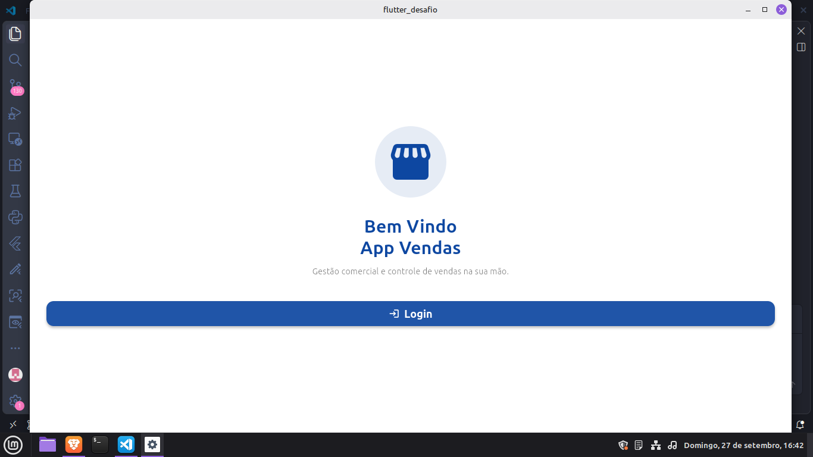
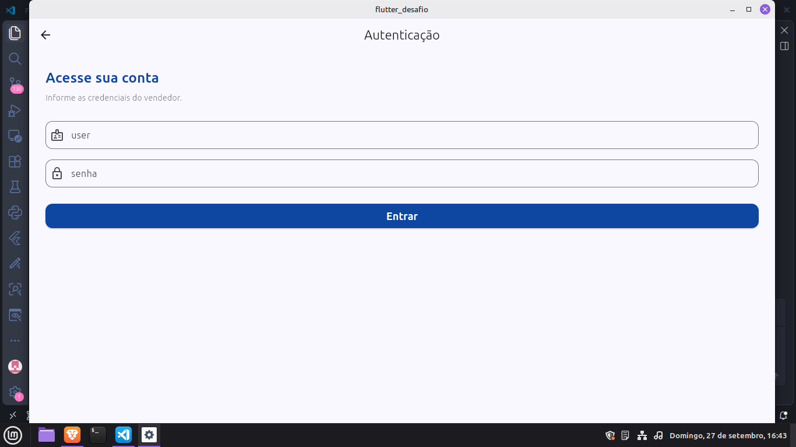
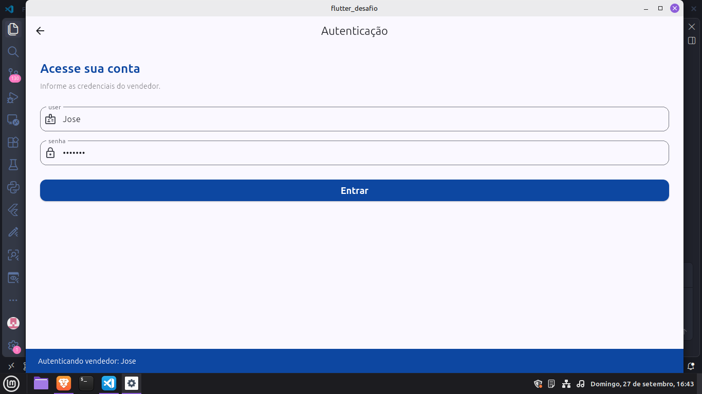

# App Vendas - Desafio de Interface Flutter (Lab 5)

Aplicação desenvolvida como desafio prático do **Lab 5** na disciplina de Desenvolvimento Mobile ministrada pelo professor **Prof°. Mateus de Paula**.

---

## Sobre a Aplicação
O app foi estruturado com base nas telas requisitadas em aula, contendo fluxo reativo entre as interfaces:
1. **Tela de Boas-Vindas:** Apresenta o título "Bem Vindo App Vendas" e o botão de acesso ao login.
2. **Tela de Login:** Formulário corporativo com os campos `user`, `senha` e o botão `Entrar`.

---

## Demonstração da Aplicação
|  |  |  |


## Nota sobre o Ambiente de Execução
A aplicação foi configurada e executada utilizando a **compilação nativa (Web)**.

```bash
flutter run 


AppVendas (MaterialApp)
  └── WelcomeScreen (Scaffold)
        └── Column
              ├── Container -> Icon (Icons.storefront_rounded)
              ├── Text ("Bem Vindo App Vendas")
              └── ElevatedButton ("Login") ──(Navegação)──> LoginScreen (Scaffold)
                                                                └── Column
                                                                      ├── TextField ("user")
                                                                      ├── TextField ("senha")
                                                                      └── ElevatedButton ("Entrar")